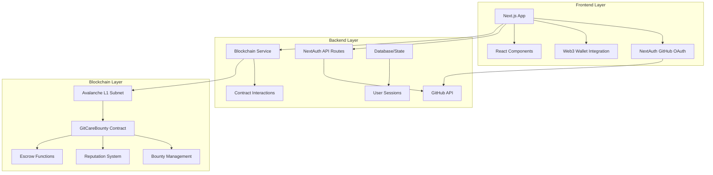

# Design Document

## Overview

The GitHub Blockchain Bounty System integrates traditional web development workflows with blockchain-based incentives using Avalanche L1 subnets. The system consists of a Next.js frontend with NextAuth GitHub integration, smart contracts deployed on Avalanche for trustless bounty management, and a comprehensive developer reputation system.

The architecture follows a hybrid approach where user authentication and UI interactions happen through traditional web technologies, while bounty creation, escrow management, and reputation tracking occur on-chain for transparency and trustlessness.

## Architecture

### High-Level Architecture



### Technology Stack

- **Frontend**: Next.js 15, React 19, TypeScript, Tailwind CSS, Framer Motion
- **Authentication**: NextAuth.js with GitHub Provider
- **Blockchain**: Avalanche L1 Subnet, Solidity ^0.8.19
- **Web3 Integration**: ethers.js or viem for contract interactions
- **State Management**: React hooks with context for blockchain state
- **UI Components**: Radix UI primitives with custom styling

## Components and Interfaces

### 1. Authentication System

#### GitHub OAuth Integration
- **NextAuth Configuration**: Extends existing setup in `app/api/auth/[...nextauth]/route.ts`
- **Session Management**: Enhanced to include GitHub profile data and blockchain wallet connection
- **User Profile**: Stores GitHub username, avatar, repositories, and linked wallet address

```typescript
interface GitHubUser {
  id: string;
  login: string;
  name: string;
  avatar_url: string;
  email: string;
  public_repos: number;
  followers: number;
  following: number;
  walletAddress?: string;
}

interface ExtendedSession extends Session {
  user: GitHubUser;
  accessToken: string;
}
```

#### Wallet Connection
- **Wallet Integration**: Support for MetaMask, WalletConnect, and other Web3 wallets
- **Network Configuration**: Automatic switching to Avalanche L1 subnet
- **Address Linking**: Associate GitHub account with blockchain wallet address

### 2. Smart Contract Integration

#### Contract Interface
The existing `GitCareBounty` contract will be enhanced with additional functionality:

```typescript
interface BountyContract {
  // Core bounty functions
  createBounty(title: string, description: string, tags: string[], deadline: number): Promise<TransactionResponse>;
  proposeCompletion(bountyId: number): Promise<TransactionResponse>;
  approveCompletion(bountyId: number): Promise<TransactionResponse>;
  
  // Enhanced functions for GitHub integration
  submitPullRequest(bountyId: number, prUrl: string, commitHash: string): Promise<TransactionResponse>;
  updatePRStatus(bountyId: number, prId: number, status: PRStatus): Promise<TransactionResponse>;
  
  // Reputation functions
  getUserReputation(address: string): Promise<UserStats>;
  getReputationHistory(address: string): Promise<ReputationEvent[]>;
}
```

#### Contract Enhancements
- **Pull Request Tracking**: New mapping to store PR submissions with GitHub URLs and commit hashes
- **Reputation Events**: Detailed logging of reputation changes with timestamps and reasons
- **Multi-submission Support**: Allow multiple developers to submit PRs for the same bounty

### 3. Frontend Components

#### Enhanced Hero Component
- **Authentication State**: Show different CTAs based on login status
- **Wallet Connection**: Integrate wallet connection with GitHub authentication
- **Error Handling**: Display connection errors and retry mechanisms

```typescript
interface HeroProps {
  isAuthenticated: boolean;
  isWalletConnected: boolean;
  onConnect: () => void;
  onDisconnect: () => void;
}
```

#### Bounty Management Interface
- **Bounty Creation Form**: Rich form with GitHub repository selection, deadline picker, and tag management
- **Bounty List**: Filterable and sortable list with real-time blockchain state updates
- **Bounty Details**: Comprehensive view showing PR submissions, timeline, and current status

#### Developer Dashboard
- **Reputation Display**: Visual representation of on-chain reputation with historical charts
- **Active Bounties**: List of bounties the user has created or is working on
- **Earnings Tracker**: Total earnings, pending payments, and transaction history

### 4. Blockchain Service Layer

#### Contract Service
```typescript
class ContractService {
  private contract: Contract;
  private provider: Provider;
  
  async createBounty(bountyData: BountyData): Promise<string>;
  async getBounty(id: number): Promise<Bounty>;
  async getUserStats(address: string): Promise<UserStats>;
  async listenToEvents(): void;
}
```

#### Transaction Management
- **Gas Optimization**: Batch transactions where possible to minimize costs
- **Error Recovery**: Retry mechanisms for failed transactions
- **State Synchronization**: Keep frontend state in sync with blockchain state

## Data Models

### Bounty Model
```typescript
interface Bounty {
  id: number;
  creator: string;
  title: string;
  description: string;
  reward: bigint;
  isCompleted: boolean;
  completedBy: string;
  createdAt: number;
  deadline: number;
  tags: string[];
  githubRepo?: string;
  pullRequests: PullRequest[];
}
```

### Pull Request Model
```typescript
interface PullRequest {
  id: number;
  bountyId: number;
  submitter: string;
  githubUrl: string;
  commitHash: string;
  status: 'pending' | 'approved' | 'rejected' | 'merged';
  submittedAt: number;
  reviewedAt?: number;
}
```

### User Reputation Model
```typescript
interface UserStats {
  address: string;
  githubUsername: string;
  completedBounties: number;
  totalEarned: bigint;
  reputation: number;
  averageCompletionTime: number;
  successRate: number;
}
```

## Error Handling

### Smart Contract Errors
- **Revert Reasons**: Clear error messages for all contract failures
- **Gas Estimation**: Pre-flight checks to prevent out-of-gas errors
- **State Validation**: Comprehensive input validation before state changes

### Frontend Error Handling
- **Network Errors**: Graceful handling of RPC failures and network switches
- **Authentication Errors**: Clear messaging for OAuth and wallet connection failures
- **Transaction Errors**: User-friendly error messages with suggested actions

### Error Recovery Strategies
- **Automatic Retries**: For transient network errors
- **Manual Retry Options**: For user-initiated actions
- **Fallback Mechanisms**: Alternative flows when primary systems fail

## Testing Strategy

### Smart Contract Testing
- **Unit Tests**: Comprehensive test coverage for all contract functions
- **Integration Tests**: End-to-end scenarios with multiple contract interactions
- **Security Tests**: Reentrancy, overflow, and access control testing
- **Gas Optimization Tests**: Ensure efficient gas usage

### Frontend Testing
- **Component Tests**: React Testing Library for UI components
- **Integration Tests**: Full user flows including wallet and contract interactions
- **E2E Tests**: Playwright tests for critical user journeys
- **Mock Services**: Isolated testing with mocked blockchain interactions

### Development Testing Approach
- **Local Blockchain**: Use Hardhat or Foundry for local development
- **Testnet Deployment**: Deploy to Avalanche Fuji testnet for integration testing
- **Staging Environment**: Full system testing before mainnet deployment

## Security Considerations

### Smart Contract Security
- **Reentrancy Protection**: ReentrancyGuard on all state-changing functions
- **Access Control**: Proper role-based permissions
- **Integer Overflow**: SafeMath or Solidity 0.8+ built-in protections
- **Front-running Protection**: Commit-reveal schemes where necessary

### Frontend Security
- **Environment Variables**: Secure handling of API keys and secrets
- **CSRF Protection**: NextAuth built-in CSRF protection
- **XSS Prevention**: Proper input sanitization and output encoding
- **Wallet Security**: Never store private keys, use secure wallet connections

### Data Privacy
- **GitHub Data**: Minimal data collection, respect user privacy
- **On-chain Data**: Consider privacy implications of public blockchain data
- **Session Management**: Secure session handling with proper expiration

## Performance Optimization

### Blockchain Performance
- **Event Filtering**: Efficient event queries with proper indexing
- **Batch Operations**: Group multiple operations to reduce transaction costs
- **State Caching**: Cache frequently accessed blockchain data
- **Lazy Loading**: Load blockchain data on-demand

### Frontend Performance
- **Code Splitting**: Dynamic imports for blockchain-heavy components
- **Image Optimization**: Next.js Image component for GitHub avatars
- **Caching Strategy**: Implement proper caching for API responses
- **Bundle Optimization**: Tree shaking and dead code elimination

## Deployment Strategy

### Smart Contract Deployment
- **Avalanche L1 Subnet**: Deploy to custom subnet for zero transaction costs
- **Contract Verification**: Verify contracts on subnet explorer
- **Upgrade Strategy**: Consider proxy patterns for future upgrades
- **Multi-signature**: Use multi-sig for contract ownership

### Frontend Deployment
- **Vercel Deployment**: Leverage Next.js optimizations
- **Environment Configuration**: Separate configs for dev/staging/prod
- **CDN Integration**: Optimize static asset delivery
- **Monitoring**: Implement error tracking and performance monitoring

## Integration Points

### GitHub API Integration
- **Repository Data**: Fetch repository information for bounty creation
- **Pull Request Webhooks**: Real-time updates when PRs are created/merged
- **User Profile**: Enhanced profile data for reputation display
- **Rate Limiting**: Respect GitHub API rate limits

### Blockchain Integration
- **RPC Endpoints**: Reliable connection to Avalanche subnet
- **Event Listening**: Real-time updates from smart contract events
- **Transaction Broadcasting**: Reliable transaction submission
- **State Synchronization**: Keep UI in sync with blockchain state

### Wallet Integration
- **Multiple Wallets**: Support for various wallet providers
- **Network Switching**: Automatic network configuration
- **Transaction Signing**: Secure transaction approval flow
- **Balance Tracking**: Real-time balance updates